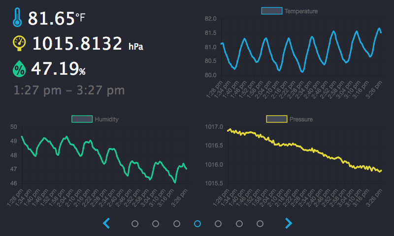

## WeatherPi

WeatherPi is both a daemon that records weather data from a BME280 sensor and a Flask web interface to display it. 

## Prerequisites

You can use the [requirements.sh](requirements.sh.txt) file to install necessary system dependencies.

##weatherd
The weatherd service polls the BME280 sensor using the Adafruit_BME280 driver and stores the results every n seconds. 
[weatherd.service](weatherd/weatherd.service) template is included for using systemd.
Alternately, you could run [weatherd.py](weatherd/weatherd.py)  directly.

##weather
[weather.wsgi](weather/weather.wsgi) and [weather.vhost.conf](weather/weather.vhost.conf) templates are included for running the web app with apache wsgi.
Alternately, you could run [weather.py](weather/weather.py) directly.

## Notes
The existing web interface is formatted to fit the official 7" RaspberryPi touchscreen.
As the project uses MySQL, it's probably best to run this on a USB drive as opposed to SDCard.
[How to boot from a usb mass storage device on a Raspberry Pi 3](https://www.raspberrypi.org/documentation/hardware/raspberrypi/bootmodes/msd.md)
